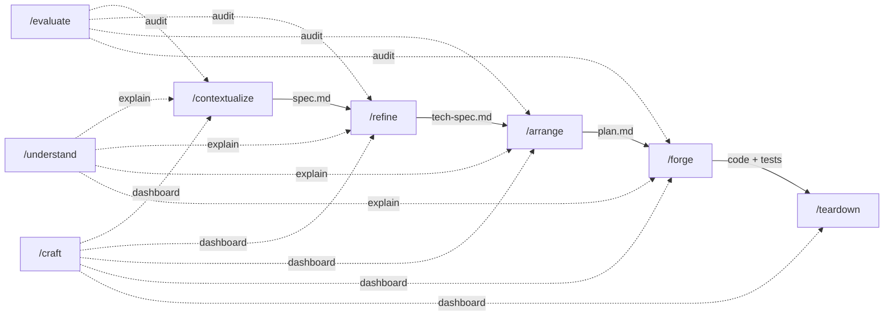

# CRAFT

A skill-based methodology for building features with [Claude Code](https://docs.anthropic.com/en/docs/claude-code). Each phase is a standalone [skill](https://docs.anthropic.com/en/docs/claude-code/skills) (slash command) that produces a concrete, versioned artifact — from product spec to production code.

```
Contextualize → Refine → Arrange → Forge → Teardown
     spec        tech-spec   plan     code    close
```

## Why CRAFT

Claude Code is powerful, but without structure it drifts: specs get skipped, tests get faked, decisions vanish between sessions. CRAFT constrains each phase into a repeatable protocol with versioned artifacts, traceability from requirements to code, and strict TDD discipline during implementation.

The methodology is opinionated. It enforces:

- **Specs before code** — no implementation without an approved product spec.
- **Design before planning** — no task decomposition without an approved technical specification.
- **Tests before implementation** — every task follows RED → GREEN → Verify. No exceptions.
- **Traceability** — every task maps to acceptance criteria. Every criterion maps to tasks. No orphans.
- **Versioned artifacts** — specs, tech-specs, and plans are versioned. Changes are tracked, not silent.

## The pipeline



Each solid arrow is a mandatory transition. Each dotted arrow is an optional auxiliary action available at any phase.

## Skills reference

### Core skills (the pipeline)

#### `/contextualize` — Product specification

> *"What are we building, and why?"*

Produces `docs/specs/<feature>/spec.md` — the **WHAT**, never the HOW.

**When to use:** Starting work on a new feature or requirement.

**What it does:**

1. **Bootstrap infrastructure** — creates `docs/specs/index.yaml` and the feature directory if they don't exist. For greenfield projects, also bootstraps `CLAUDE.md`.
2. **Critical analysis** — challenges assumptions, detects gaps (empty states, errors, concurrency, permissions), proposes alternatives, and forces clarity on ambiguous words like "basic" or "simple". Uses focused Q&A rounds, not 20 questions at once.
3. **Visual design gate** — for features with UI, asks whether a design exists, offers to generate one via the `ui-designer` agent (Stitch), or annotates the skip.
4. **Spec authoring** — writes versioned `spec.md` with overview, user stories, acceptance criteria (GIVEN/WHEN/THEN), out of scope, and open questions.
5. **Spec audit** — self-evaluates every story and criterion against 8 dimensions: multiplicity, lifecycle, ownership, empty state, failure, boundaries, dependencies, and temporal triggers.
6. **Review and approval** — presents the complete spec for user review. Iterates until approved. Updates `index.yaml` with `status: spec-ready`.

**Output:** `docs/specs/<feature>/spec.md` (versioned, frontmatter with status and spec_version)

**Key rules:**
- One spec per feature, never a monolith.
- The spec is the WHAT. No architecture, types, file paths, or implementation details.
- Never overwrites existing specs without consent — increments `spec_version` on updates.

**Transition:** Suggests `/evaluate` (optional audit) or `/refine` (next phase).

---

#### `/refine` — Technical specification

> *"How are we building it?"*

Produces `docs/specs/<feature>/tech-spec.md` — bridges the gap between "what we want" and "how we build it."

**When to use:** After a spec is approved and before planning implementation.

**Prerequisites:** An approved `spec.md` for the feature.

**What it does:**

1. **Gathers context** — reads the spec, project context (`CLAUDE.md`), cross-cutting decisions (`docs/specs/decisions.md`), related tech-specs, and explores the codebase for existing patterns, utilities, types, schemas, and component structures.
2. **Designs architecture** — determines which layers are touched (DB, backend, API, frontend), maps the data flow, identifies new models/migrations/routes.
3. **Defines interfaces** — writes **exact code** for key interfaces: database schemas, TypeScript types, PHP classes, API shapes, structured output schemas. Not pseudocode.
4. **Documents decisions** — for every non-obvious decision, records context, options considered with trade-offs, and rationale for the chosen option. Cross-cutting decisions (affecting multiple features) go to `docs/specs/decisions.md`.
5. **Maps edge cases** — tabulates edge cases with their handling strategy.
6. **File inventory** — lists every file to create or modify with action and description.
7. **Dependencies** — documents what this feature requires, what requires it, and external packages/APIs needed.

**Output:** `docs/specs/<feature>/tech-spec.md` (versioned, linked to spec via `based_on_spec_version`)

**Key rules:**
- If a spec gap is discovered during design, updates `spec.md` inline (`spec_version++`) and continues — does not exit to re-run `/contextualize`.
- The tech-spec must be concrete enough that any developer (or agent) can implement from it without asking questions.
- Cross-cutting decisions go to `decisions.md`, feature-specific decisions stay in the tech-spec.

**Transition:** Suggests `/evaluate` (optional) or `/arrange` (next phase).

---

#### `/arrange` — Implementation plan

> *"In what order do we build it, and how do we verify each step?"*

Produces `docs/specs/<feature>/plan.md` — atomic tasks of 1-2 minutes each with TDD steps and parallelizability markers.

**When to use:** After a tech-spec is approved and before implementation.

**Prerequisites:** Approved `spec.md` AND `tech-spec.md`.

**What it does:**

1. **Analyzes the tech-spec** — identifies every file, interface, decision, and dependency ordering.
2. **Decomposes into atomic tasks** — each task is 1-2 minutes of work with ALL of these fields:
   - **Task N**: one-sentence description
   - **File**: exact path
   - **Why**: which acceptance criterion it covers (with description, never bare codes like "AC-3"), what it depends on, what it enables
   - **RED**: write test X that asserts Y, run command, expect FAIL
   - **GREEN**: write minimal code to pass, run command, expect PASS
   - **Verify**: exact command with expected output
   - **Parallel-safe**: yes / no / after-task-N
3. **Groups into batches** — parallel-safe tasks are batched for concurrent execution.
4. **Builds traceability matrix** — maps every acceptance criterion to its tasks and vice versa. No uncovered criteria, no orphan tasks.
5. **Self-review** — verifies decomposition size, completeness of fields, parallelizability correctness, and full file inventory coverage.

**Output:** `docs/specs/<feature>/plan.md` with summary, traceability matrix, test commands, and batched tasks.

**Decomposition rules:**
- Test infrastructure first (factories, fixtures).
- One file per task when possible.
- Backend before frontend.
- Schema before logic.
- One test, one behavior, one task.
- Every task references at least one AC with description.

**Transition:** Suggests `/evaluate` (optional) or `/forge` (next phase).

---

#### `/forge` — Implementation

> *"Build it. Test-first. No shortcuts."*

Executes the plan task by task with strict TDD discipline: RED (failing test) → GREEN (minimal code to pass) → Verify.

**When to use:** After a plan is approved and you're ready to write code.

**Prerequisites:** A `plan.md` with unchecked tasks.

**What it does:**

1. **Loads state** — finds the first unchecked task, reports progress (Task N of M).
2. **Chooses execution mode** (asked once per session):
   - **Supervised** (default): one task at a time, shows results, waits for explicit approval (Approve / Fix / Skip / Stop).
   - **Sequential**: auto-advances after verify. Post-batch review every 5 tasks via a critical subagent.
   - **Parallel**: launches subagents for parallel-safe batches. Post-batch review after each batch.
3. **Executes each task**:
   - **RED** — writes the test, runs it, verifies it FAILS. If it passes, the test is wrong — fixes until it fails for the right reason.
   - **GREEN** — writes minimal code, runs the test, verifies it PASSES. If it fails, fixes the code (never the test).
   - **Verify** — runs the exact verify command, reads the output. Never says "should work."
   - **Update** — marks task complete in `plan.md`.

**Learning mode** (ON by default, disable with "no-learn"):

After each GREEN step, shows a learning block:
- What was done, why this task exists, how it connects to other tasks and acceptance criteria.
- Framework/domain concepts when touching unfamiliar patterns.

**Discovery protocol** — when reality diverges from the plan:

| Level | Situation | Action |
|-------|-----------|--------|
| **1: Detail gap** | Missing detail, doesn't change architecture | Make the reasonable decision, document it, continue |
| **2: Spec gap** | Missing edge case, missing AC | STOP. Amend spec/tech-spec/plan inline (version++). Present amendment for approval. Continue |
| **3: Premise broken** | Fundamental approach doesn't work | STOP completely. Summarize what works, what doesn't. Direct to `/refine` for redesign |

**Cross-cutting rules (non-negotiable):**
- No production code without a failing test.
- Never skip the RED step — run it, see the failure.
- Verify before claiming done — run the command, read the output, in the current message.
- If the plan diverges from reality, stop and update.
- If a task takes more than 2 minutes, it's too big — decompose.
- One behavior per task.

**Rationalization table:**

The skill includes a table of common rationalizations ("this is too simple to need a test", "I already know this will pass", "I can combine these two tasks") with prescribed responses to prevent shortcuts.

**Transition:** After all tasks, suggests `/evaluate` (recommended audit) or `/teardown`.

---

#### `/teardown` — Session close

> *"Leave the project better documented than you found it."*

Closes a session cleanly with everything the next session needs to start without re-explanation.

**When to use:** When finishing a session or completing a feature.

**What it does:**

1. **Reviews changes** — runs `git diff` and `git status` to understand what changed.
2. **Captures implicit decisions** — identifies decisions not self-evident from the code (trade-offs, constraints discovered during implementation). Updates tech-spec if needed.
3. **Updates plan progress** — verifies all completed tasks are marked, notes deviations.
4. **Updates feature index** — sets status in `index.yaml` to `done` (all tasks complete) or `in-progress` (tasks remain).
5. **Updates project context** — adds new conventions or gotchas to `CLAUDE.md` if project-level context changed.
6. **Proposes commits** — suggests atomic, coherent commits with messages explaining WHY. Presents for approval.
7. **Session summary** — if tasks remain: handoff message with next task. If complete: feature done message.

**Output:** Updated `index.yaml`, tech-spec (if decisions captured), `CLAUDE.md` (if conventions changed), proposed commits.

---

### Auxiliary skills

These are not part of the pipeline but enhance it at any phase.

#### `/evaluate` — Evaluator-Optimizer audit

> *"Prove it."*

Critically evaluates every claim, decision, and assertion from the previous output against verifiable evidence.

**When to use:** After any phase to audit its output, or whenever you want independent verification. Recommended after `/contextualize` (complex features), `/arrange` (verify traceability), and `/forge` (verify all ACs are implemented).

**What it does:**

1. **Identifies claims** — every factual assertion, decision, recommendation, assumption, behavioral description, dependency reference, or architectural statement.
2. **Verifies each claim** — locates the primary source of truth (actual code, config, docs, API response, manifest) and classifies:
   - `VERIFIED` — evidence supports the claim
   - `PARTIALLY CORRECT` — core idea holds, details wrong
   - `UNVERIFIED` — no evidence found
   - `INCORRECT` — evidence contradicts the claim
   - `OUTDATED` — was true, current state differs
3. **Produces a summary table** with claim, verdict, evidence source (file:line, URL, command output), and notes.
4. **Reports** — critical findings (INCORRECT/OUTDATED), risks (UNVERIFIED with high impact), and a reliability score (X/N verified).

**Multi-pass mode:** Pass an argument (e.g., `/evaluate 2`) to run multiple passes. Pass 2+ evaluates the evaluator's own previous findings with the same rigor, marking corrections as `SELF-CORRECTED`.

**Key rules:**
- Does NOT suggest fixes or improvements. Only verifies.
- Does NOT skip claims because they "seem obvious."
- Does NOT soften verdicts. Wrong is `INCORRECT`.
- Every verdict cites a specific source. "I believe" is not evidence.

---

#### `/understand` — Concept explainer

> *"Explain it so I can work with it."*

On-demand concept explanations sized for a working software engineer — not an encyclopedia.

**When to use:** When you need to understand a concept, pattern, framework feature, architectural decision, or how pieces of the project connect. Works inside or outside CRAFT sessions.

**What it does:**

1. **Resolves topic** — from argument (`/understand WebSockets`), CRAFT context (explains current artifact), or asks.
2. **Researches** — reads actual code for project components, checks existing usage for framework concepts, searches docs if needed. Never explains from memory alone.
3. **Explains** with right-sized sections (only those that add value):
   - **What it is** — plain language, no undefined jargon
   - **How it works** — mechanism, flow, internals. Includes Mermaid diagrams when they clarify architecture or data flow
   - **In this project** — actual usage with file paths and line numbers
   - **When to use it (and when not to)** — trade-offs, alternatives
   - **Prerequisites** — what you need to know first
4. **Persists (optional)** — saves substantial explanations to `docs/understand/<topic>.md`.
5. **Iterates** — stays open for follow-ups: expand, compare, simplify, add examples.

**Key rules:**
- Right-sized, not exhaustive. Target: what a competent engineer needs.
- Uses the user's project as the example when possible.
- Verifies before explaining — reads code, checks docs.
- Respects the user's level — doesn't explain what they already know.

---

#### `/craft` — Status dashboard

> *"Where are we?"*

Read-only dashboard showing feature status at a glance.

**When to use:** To check the current state of a feature or see an overview of all features.

**What it does:**

- **Single feature** (`/craft dojo-streaming`): shows which artifacts exist (spec, tech-spec, plan), their status and version, current phase, progress (X of Y tasks done if plan exists), dependencies, and suggested next action.
- **Overview** (no argument): reads `index.yaml`, groups features by status (done, in-progress, planned, draft), shows counts, and highlights active work with suggested next action.

**Output:** A concise status table. Takes 5 seconds to read.

**Key rules:**
- Read-only. Never creates or modifies files.
- Reports status and suggests next actions. Does not orchestrate.

---

### Agent

#### `ui-designer` — UI mockup generator

Generates production-quality UI mockups using [Stitch](https://stitch.withgraphite.com/) from feature specifications. Used by `/contextualize` during the visual design gate (step 4).

**What it does:**

- Reads design tokens from the project context (colors, fonts, style direction).
- Generates polished screens (not wireframes) with proper contrast, typographic hierarchy, consistent spacing, visual feedback states, and realistic placeholder content.
- Produces mockups for key states: empty, populated, loading, error.

## Installation

### 1. Clone this repository

```bash
git clone https://github.com/juanwmedia/craft.git ~/code/craft
```

### 2. Symlink skills and agents

CRAFT skills are loaded by Claude Code from `~/.claude/skills/`. Each skill needs its own symlink:

```bash
# Create the skills directory if it doesn't exist
mkdir -p ~/.claude/skills

# Symlink each CRAFT skill
for skill in contextualize refine arrange forge teardown craft evaluate understand; do
  ln -s ~/code/craft/skills/$skill ~/.claude/skills/$skill
done

# Symlink the agents directory
ln -s ~/code/craft/agents ~/.claude/agents
```

If you already have other skills in `~/.claude/skills/`, this won't conflict — each skill is its own directory.

### 3. Verify

Start a Claude Code session and type `/craft`. You should see the status dashboard. If you have no features yet, it will prompt you to run `/contextualize`.

## Workflow: building a feature end-to-end

```
1. /contextualize user-auth
   → Collaborative Q&A, spec audit
   → Produces docs/specs/user-auth/spec.md (approved)

2. /refine user-auth
   → Reads spec, explores codebase, designs architecture
   → Produces docs/specs/user-auth/tech-spec.md (approved)

3. /arrange user-auth
   → Decomposes into 12 atomic TDD tasks, 4 parallel batches
   → Produces docs/specs/user-auth/plan.md

4. /forge user-auth
   → Executes tasks: RED → GREEN → Verify, one by one
   → "Task 1 of 12: Create users migration"
   → "Task 2 of 12: Add User model with fillable fields"
   → ...
   → "All 12 tasks complete."

5. /teardown user-auth
   → Reviews changes, captures decisions, proposes commits
   → "Feature user-auth is complete. Index updated to status: done."
```

At any point:
- `/evaluate` — audit the latest output for correctness
- `/understand WebSockets` — get a right-sized explanation
- `/craft` — check where you are

## File structure conventions

CRAFT uses a standard directory layout under `docs/specs/`:

```
docs/
└── specs/
    ├── index.yaml              # Feature registry (name, status, priority, version)
    ├── decisions.md            # Cross-cutting decisions (affect multiple features)
    └── <feature-slug>/
        ├── spec.md             # Product spec (the WHAT) — /contextualize
        ├── tech-spec.md        # Technical spec (the HOW) — /refine
        └── plan.md             # Implementation plan (atomic tasks) — /arrange
```

### `index.yaml`

Central registry of all features:

```yaml
project: my-project
features:
  - name: user-auth
    title: User Authentication
    status: done          # draft | spec-ready | tech-ready | planned | in-progress | done
    priority: P1
    spec_version: 2
    depends-on: []
  - name: notifications
    title: Push Notifications
    status: in-progress
    priority: P2
    spec_version: 1
    depends-on: [user-auth]
```

### Artifact versioning

- `spec.md` has `spec_version` in frontmatter. Incremented when acceptance criteria change.
- `tech-spec.md` has `based_on_spec_version` linking it to the spec it was designed against.
- `plan.md` has `based_on_tech_spec_version` linking it to the tech-spec.
- When upstream artifacts change, downstream artifacts may need updating — the version links make this traceable.

### Status flow

```
draft → spec-ready → tech-ready → planned → in-progress → done
  ↑        ↑             ↑           ↑            ↑          ↑
  /contextualize  /refine    /arrange     /forge      /teardown
```

## Design principles

1. **Each skill does one thing.** Contextualize writes specs. Refine writes tech-specs. Arrange writes plans. Forge writes code. Teardown closes. No skill crosses its boundary.

2. **Artifacts over memory.** Everything is written to disk in versioned files. Nothing relies on conversation context surviving between sessions.

3. **Forward-only with inline amendments.** When a later phase discovers a gap in an earlier artifact, it amends inline (with version increment) and continues. It does not exit to re-run the earlier skill.

4. **Traceability is mandatory.** Every task maps to acceptance criteria. Every criterion maps to tasks. Every tech-spec links to the spec version it was designed against. Every decision records its rationale.

5. **TDD is non-negotiable.** In Forge, every task follows RED → GREEN → Verify. The rationalization table exists specifically to prevent "this is too simple to need a test" shortcuts.

6. **The plan is a contract.** If the plan says "write test X that asserts Y", Forge writes exactly that. Deviations require plan updates.

## License

MIT
