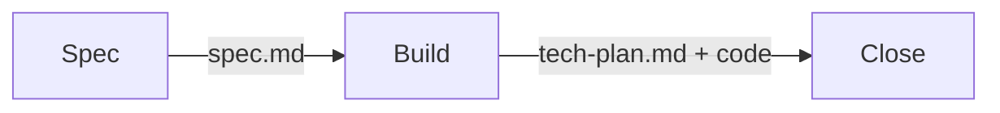
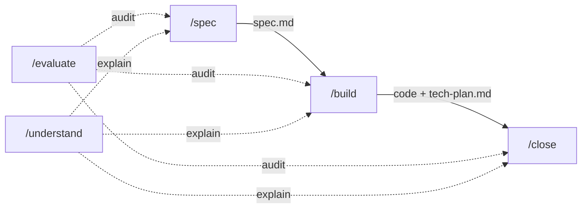
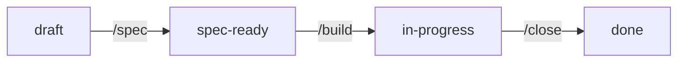

# Craft

A [Claude Code](https://docs.anthropic.com/en/docs/claude-code) plugin for building features with structured methodology. Three skills, three artifacts.



## Why Craft

AI coding agents are powerful, but without structure they drift: specs get skipped, tests get faked, decisions vanish between sessions. Craft constrains each phase into a repeatable protocol with versioned artifacts and traceability from requirements to code.

The methodology is opinionated. It enforces:

- **Specs before code** — no implementation without an approved product spec.
- **Design before execution** — no code without a tech-plan with design decisions and atomic tasks.
- **Traceability** — every task maps to acceptance criteria. Coverage is verified before execution starts.
- **Iteration over perfection** — build, test, adjust the plan, repeat. Specs are reconciled at the end, not mid-execution.
- **Versioned artifacts** — specs and tech-plans are versioned. Changes are tracked, not silent.
- **Security and quality are automated** — secrets detection and lint/format/typecheck run before every commit.

## The pipeline



Solid arrows are mandatory transitions. Dotted arrows are optional auxiliaries available at any phase.

## Skills reference

### Core skills

#### `/spec` — Define what to build

> *"What are we building, and why?"*

Produces `docs/specs/<feature>/spec.md` — the **WHAT**, never the HOW.

**Without argument:** shows a read-only dashboard with all features grouped by status, progress, and suggested next action.

**With a feature slug:** enters spec mode:

1. **Bootstrap infrastructure** — creates `docs/specs/index.yaml` and the feature directory if they don't exist. For greenfield projects, also bootstraps `CLAUDE.md`.
2. **Critical analysis** — challenges assumptions, detects gaps (empty states, errors, concurrency, permissions), proposes alternatives, and forces clarity on ambiguous words. Focused Q&A rounds, not 20 questions at once.
3. **Visual design gate** — for UI features, asks for a design or generates one via the `ui-designer` agent.
4. **Spec authoring** — versioned `spec.md` with overview, user stories, acceptance criteria (GIVEN/WHEN/THEN), out of scope, and open questions.
5. **Spec audit** — self-evaluates against 8 dimensions: multiplicity, lifecycle, ownership, empty state, failure, boundaries, dependencies, temporal triggers.
6. **Review and approval** — iterates until the user approves.

**Output:** `docs/specs/<feature>/spec.md`

**Transition:** `/evaluate` (optional) → `/build`

---

#### `/build` — Design, plan, and implement

> *"How do we build it? In what order? Go."*

Reads the approved spec, enters native plan mode to produce a tech-plan with design decisions and atomic tasks, then executes — iterating as many times as needed.

**Flow:**

1. **Enter plan mode** — reads the spec, explores the codebase, designs the architecture.
2. **Produce `tech-plan.md`** — design decisions (with trade-offs and rationale) + atomic tasks grouped in parallel batches + empty iteration log.
3. **User approves the plan.**
4. **Verify coverage** — checks that every acceptance criterion has at least one task, and every task covers at least one AC. No uncovered criteria, no orphan tasks.
5. **Create native tasks** for tracking.
6. **Execute** — spawns subagents for parallel batches, keeps sequential what needs control. Prioritizes correctness over speed.
7. **If something fails** — re-enters plan mode, adjusts, appends to the iteration log. Repeats until stable.

**Subagent execution:**

When spawning subagents for parallel tasks, each subagent reports back with a structured status:
- **DONE** — task completed, files changed, tests pass.
- **DONE_WITH_CONCERNS** — completed but something unexpected was found. Investigated before the next batch starts.
- **BLOCKED** — cannot proceed. Blocker resolved before re-running.

Model selection for subagents uses the `Agent` tool's `model` parameter:
- **haiku** for scaffolding, config, static content.
- **sonnet** for implementation with business logic.
- **opus** for deep architectural reasoning.

**Spec clarification:**

When a spec gap blocks downstream tasks, the agent pauses and asks the user a focused question. The decision is recorded in the tech-plan's Design Decisions (not in the spec). Formal spec reconciliation happens in `/close`.

**Multi-session resume:**

If a feature is `in-progress` with unchecked tasks in the tech-plan, `/build` resumes from where it left off — no re-planning needed.

**Output:** `docs/specs/<feature>/tech-plan.md` + implemented code and tests

**Key rules:**
- Tests where they matter: business logic, data integrity, auth, API contracts. Agent's judgment for the rest.
- **No commits during `/build`.** All commits happen in `/close`.
- The iteration log tracks what changed and why across re-entries.

**Transition:** `/evaluate` (optional) → `/close`

---

#### `/close` — Reconcile and persist

> *"What did we actually build? Make the record match reality."*

Reconciles what was built against what was specified. Runs pre-commit checks, updates artifacts, captures learnings, proposes commits.

**Flow:**

1. **Review changes** — `git diff`, `git status`.
2. **Reconcile spec.md** — compare acceptance criteria against actual implementation. Add new ACs for behavior that was built, flag unimplemented ones, mark verified criteria. Increment `spec_version`.
3. **Reconcile tech-plan.md** — ensure all tasks are marked, iteration log is clean.
4. **Capture findings** — cross-cutting decisions → `decisions.md`, project gotchas → `CLAUDE.md`.
5. **Update `index.yaml`** — status to `done` or `in-progress`.
6. **Pre-commit checks:**
   - **Security scan** — searches the diff for hardcoded secrets (API keys, tokens, private keys, connection strings). Blocks commits if found.
   - **Quality gate** — detects the project's lint/format/typecheck tools and runs them. Fixes mechanical errors before committing.
7. **Propose commits** — atomic, WHY-focused. User must approve.

**Output:** Reconciled spec + tech-plan, updated index, proposed commits.

**Transition:** `/evaluate` (optional final audit)

---

### Auxiliary skills

#### `/evaluate` — Evaluator-Optimizer audit

> *"Prove it."*

Critically evaluates every claim, decision, and assertion from the previous output against verifiable evidence. Classifies each as VERIFIED, PARTIALLY CORRECT, UNVERIFIED, INCORRECT, or OUTDATED. Every verdict cites a specific source. Multi-pass mode available (`/evaluate 2`) for self-evaluation.

Does NOT suggest fixes. Only verifies.

---

#### `/understand` — Concept explainer

> *"Explain it so I can work with it."*

On-demand concept explanations sized for a working software engineer. Researches before explaining (reads code, checks docs). Includes Mermaid diagrams when they clarify. Can persist substantial explanations to `docs/understand/`. Works inside or outside Craft sessions.

---

### Agent

#### `ui-designer` — UI mockup generator

Generates production-quality UI mockups using [Stitch](https://stitch.withgraphite.com/) from feature specifications. Used by `/spec` during the visual design gate.

## Installation

### Option A: Plugin marketplace (recommended)

```bash
/plugin marketplace add juanwmedia/craft
/plugin install craft@craft
```

All 5 skills and the agent are installed automatically. Updates via `/plugin marketplace update`.

### Option B: Manual symlinks

```bash
git clone https://github.com/juanwmedia/craft.git ~/code/craft

mkdir -p ~/.claude/skills

for skill in spec build close evaluate understand; do
  ln -s ~/code/craft/skills/$skill ~/.claude/skills/$skill
done

ln -s ~/code/craft/agents ~/.claude/agents
```

### Upgrading from v1

If you have v1 symlinks (contextualize, refine, arrange, forge, teardown, craft), remove them first:

```bash
for old in contextualize refine arrange forge teardown craft; do
  rm ~/.claude/skills/$old 2>/dev/null
done
```

### Verify

Start a new session and type `/spec`. You should see the dashboard. If you have no features yet, it will prompt you to run `/spec <feature-slug>`.

## Workflow: building a feature end-to-end

```
1. /spec user-auth
   → Collaborative Q&A, spec audit, visual design gate
   → Produces docs/specs/user-auth/spec.md (approved)

2. /build user-auth
   → Enters plan mode, designs architecture, decomposes tasks
   → Verifies AC coverage (12/12 ACs, 0 orphan tasks)
   → Executes: subagents (haiku/sonnet) for parallel batches
   → Iterates: B1 (initial), B2 (fix API issue), B3 (edge case)
   → Produces code + docs/specs/user-auth/tech-plan.md

3. /close user-auth
   → Reconciles spec with what was built (spec v1 → v2)
   → Security scan: no secrets found
   → Quality gate: eslint + tsc pass
   → Proposes atomic commits
   → "Feature user-auth complete. Spec reconciled to v2."
```

At any point:
- `/evaluate` — audit the latest output for correctness
- `/understand WebSockets` — get a right-sized explanation
- `/spec` — check the dashboard

## Multi-session workflow

Features that span multiple sessions are handled naturally:

```
Session 1:
  /build user-auth → completes tasks T1-T8 of 15
  /close user-auth → commits progress, status: in-progress

Session 2:
  /build user-auth → resumes at T9, skips plan mode
  → "Resuming user-auth: 8 of 15 tasks done. Next: T9."
  → completes T9-T15
  /close user-auth → final reconciliation, status: done
```

`/build` detects `in-progress` status and unchecked tasks in the tech-plan, recreates native tasks for the remaining work, and continues execution without re-planning.

## File structure conventions

```
docs/
└── specs/
    ├── index.yaml              # Feature registry (name, status, priority, version)
    ├── decisions.md            # Cross-cutting decisions (affect multiple features)
    └── <feature-slug>/
        ├── spec.md             # Product spec (the WHAT) — /spec
        └── tech-plan.md        # Design + tasks + iteration log — /build
```

### `index.yaml`

```yaml
project: my-project
features:
  - name: user-auth
    title: User Authentication
    status: done          # draft | spec-ready | in-progress | done
    priority: P1
    spec_version: 2
    depends-on: []
```

### Artifact versioning

- `spec.md` has `spec_version` in frontmatter. Incremented during `/close` when acceptance criteria change.
- `tech-plan.md` has `based_on_spec_version` linking it to the spec version it was designed against.
- The iteration log inside `tech-plan.md` tracks plan changes across `/build` re-entries.

### Status flow



## v1

The original 5-skill pipeline (Contextualize → Refine → Arrange → Forge → Teardown) is preserved in [`v1/`](./v1/) for reference.

## Design principles

1. **Each skill does one thing.** Spec defines. Build implements. Close reconciles. No skill crosses its boundary.

2. **Artifacts over memory.** Everything is written to disk in versioned files. Nothing relies on conversation context surviving between sessions.

3. **Iteration over perfection.** Build, test, discover, adjust the plan, repeat. Specs are reconciled with reality at the end — not mid-execution.

4. **Traceability is verified, not assumed.** Every task maps to acceptance criteria. Coverage is checked before execution starts — no uncovered ACs, no orphan tasks.

5. **Tests where they matter.** Business logic, data integrity, authentication, API contracts. Not every line of scaffolding or configuration.

6. **The tech-plan is the contract.** If the plan says "implement X", that's what gets built. Deviations go through the iteration log.

7. **Security and quality are automated.** Secrets detection and lint/format/typecheck run before every commit in `/close`. Not optional, not manual.

## License

MIT
