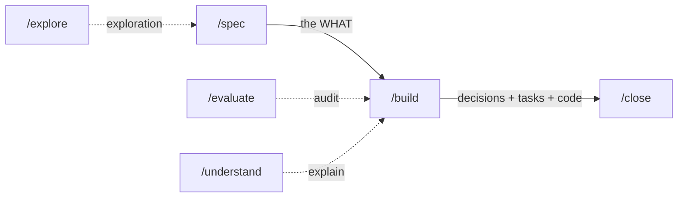

# Craft

A [Claude Code](https://docs.anthropic.com/en/docs/claude-code) plugin — a methodology for building features as **living visual documents**: one place per feature, in a format made for human understanding, kept current in real time.

## The idea

Most tooling makes you abstract away while the work happens, then hands you back an artifact — a markdown plan, a spec, a diff dump — that you have to reverse-engineer to understand. That **messy middle** breeds insecurity and kills the joy of the work.

Craft removes it. Everything a feature produces — the exploration, the WHAT (acceptance criteria), the HOW (decisions + tasks), the execution, the frictions, any mockup — lives on **one board** per feature (`docs/specs/<feature>/data.json`, rendered as live-reloading HTML you watch fill in real time). Two pillars (`references/design-principles.md`):

- **A format built for understanding** — HTML with colors, shapes, arrows and live reload, on a shared design system so structure isn't reinvented each time — not raw markdown artifacts.
- **One feature, one place** — what used to scatter across `explore.md` / `spec.md` / `tech-plan.md` now lives together on the board.

## You're always in, or you're not — never the messy middle

Collaboration runs in one of two modes (`references/modes.md`):

- **`in the loop`** (default) — you're in every decision at the smallest grain: the shape, each acceptance criterion, each task, each change. Nothing is produced for one-shot approval; the board fills as you talk. You always know what you're looking at, because you decided it.
- **`above the loop`** — you say what you want and validate the result: present at the start and the end, not the middle. Opt-in, explicit, never silent.

Either is fine. The messy middle — half-in, handed something you can't follow — is the one thing Craft refuses.

## The lifecycle


```mermaid
graph LR
    X["/explore"] -.->|exploration| S["/spec"]
    S -->|the WHAT| B["/build"]
    B -->|decisions + tasks + code| C["/close"]
    E["/evaluate"] -.->|audit| B
    U["/understand"] -.->|explain| B
```

All four lifecycle skills write to the **same board** (`data.json`); the HTML is generated from it. Every task maps to an acceptance criterion (coverage is checked before code), and features ship in **phases** — each a vertical slice that puts something usable on screen, Phase 1 proving the core assumption.

## Quick start

```
/explore <feature>   → (optional) hands-on tech exploration, written onto the board
/spec <feature>      → define what to build (north star, acceptance criteria, phases)
/build <feature>     → decide the how + implement, task by task, in the loop
/close <feature>     → reconcile the board, graduate findings, propose commits
```

`/evaluate` audits at any point; `/understand` explains concepts; `/craft-serve` starts the live board.

## File structure

```
docs/specs/
├── index.yaml              # Feature registry (status, priority, phases)
├── decisions.md            # Cross-cutting decisions (only /close writes; created on demand)
└── <feature-slug>/
    ├── data.json           # The feature's single source of truth: exploration + WHAT + HOW + live status
    └── mockup.html         # Optional annotated UI mockup

~/code/craft/
├── lib/                    # craft-serve.js (live board server) + doc/dashboard templates + schema.md + mockup-guide.md
├── references/             # modes.md · design-principles.md · discipline.md — inherited by all skills
└── skills/                 # explore · spec · build · close · evaluate · understand · craft-serve
```

## Skills

| Skill | Purpose | Writes to |
|-------|---------|-----------|
| `/explore` | Hands-on technology exploration | the board (`exploration`) |
| `/spec` | Define the WHAT + acceptance criteria | the board (`what`, `phases`) |
| `/build` | Decide the HOW + implement, in the loop | the board (`decisions`, `tasks`, status) + code |
| `/close` | Reconcile, graduate findings, propose commits | the board + `CLAUDE.md` / registry |
| `/evaluate` | Evidence-based audit of any output | verification findings |
| `/understand` | Concept explanations with diagrams | explanation (optional file) |
| `/craft-serve` | Start or confirm the live board server | — |

Each skill's full documentation is in `skills/<name>/SKILL.md`. The data contract is `lib/schema.md`.

## Installation

### Plugin marketplace (recommended)

```bash
/plugin marketplace add juanwmedia/craft
/plugin install craft@craft
```

### Manual symlinks

```bash
git clone https://github.com/juanwmedia/craft.git ~/code/craft
mkdir -p ~/.claude/skills
for skill in explore spec build close evaluate understand craft-serve; do
  ln -s ~/code/craft/skills/$skill ~/.claude/skills/$skill
done
ln -s ~/code/craft/agents ~/.claude/agents
```

## License

MIT
