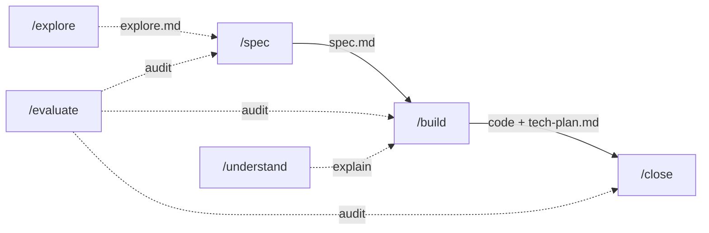

# Craft

A [Claude Code](https://docs.anthropic.com/en/docs/claude-code) plugin for building features with structured methodology.


```mermaid
graph LR
    X["/explore"] -.->|explore.md| S["/spec"]
    S -->|spec.md| B["/build"]
    B -->|code + tech-plan.md| C["/close"]
    E["/evaluate"] -.->|audit| S
    E -.->|audit| B
    E -.->|audit| C
    U["/understand"] -.->|explain| B
```

## Why Craft

- **Specs before code** — no implementation without approved requirements
- **Phased delivery** — large features sliced into vertical slices. Phase 1 proves the core assumption.
- **Traceability** — every task maps to acceptance criteria. Coverage verified before execution.
- **Iteration over perfection** — build, test, adjust plan, repeat. Specs reconciled at the end.

## Quick start

```
/spec user-auth        → define what to build (collaborative Q&A, spec audit)
/build user-auth       → design, plan, implement (tech-plan + code)
/close user-auth       → reconcile, capture findings, commit
```

Optional steps: `/explore` before spec (new tools), `/evaluate` at any point (audit), `/understand` (explain concepts).

## Installation

### Plugin marketplace (recommended)

```bash
/plugin marketplace add juanwmedia/craft
/plugin install craft@craft
```

### Manual symlinks

```bash
git clone https://github.com/juanwmedia/craft.git ~/code/craft
mkdir -p ~/.claude/skills
for skill in explore spec build close evaluate understand; do
  ln -s ~/code/craft/skills/$skill ~/.claude/skills/$skill
done
ln -s ~/code/craft/agents ~/.claude/agents
```

## File structure

```
docs/specs/
├── index.yaml              # Feature registry (status, priority, version)
├── decisions.md            # Cross-cutting decisions
└── <feature-slug>/
    ├── explore.md          # Capabilities map (optional)
    ├── spec.md             # Product spec (the WHAT)
    └── tech-plan.md        # Design + tasks + iteration log
```

## Skills

| Skill | Purpose | Output |
|-------|---------|--------|
| `/explore` | Hands-on technology exploration | `explore.md` |
| `/spec` | Define requirements + acceptance criteria | `spec.md` |
| `/build` | Plan, implement, iterate | `tech-plan.md` + code |
| `/close` | Reconcile, capture findings, commit | Updated artifacts |
| `/evaluate` | Evidence-based audit of any output | Verification table |
| `/understand` | Concept explanations with diagrams | Explanation (optional file) |

Each skill's full documentation is in `skills/<name>/SKILL.md`.

## License

MIT
