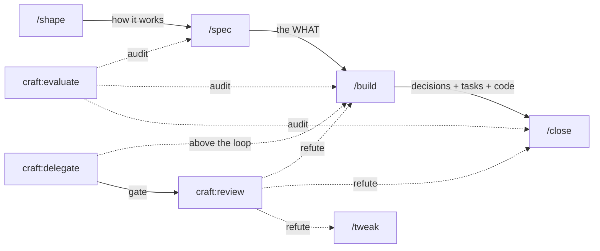

# Craft

A [Claude Code](https://docs.anthropic.com/en/docs/claude-code) plugin. An opinionated methodology for building software with AI agents and enjoy the process: one living board per feature, in a format built for human understanding, kept current as you build.

> **The messy middle** is half in, half out. You traded control for speed and got neither. The work happened without you, and now it is yours to understand, review and repair. The worst of both worlds, and the one thing Craft refuses.

## The idea

Most tooling makes you step away while the work happens, then hands you back an alien artifact (a markdown plan, a spec, a diff dump) that you reverse-engineer to understand. That is the messy middle. It breeds insecurity and kills the joy of the work.

Craft removes it. Everything a feature produces (how it works, how it looks, the acceptance criteria, the decisions and tasks, the execution, the frictions) lives on **one visual board** per feature: `docs/craft/<feature>/data.json`, rendered as live HTML you watch fill in as you talk.

Two pillars:

- **A format built for understanding**: HTML with colors, shapes, arrows and live reload, on a shared design system, not raw markdown artifacts.
- **One feature, one place**: nothing scattered across plans, specs and tech notes.

## You're always in, or you're not, NEVER in the messy middle

**What the thing is, is always yours.** `/shape` and `/spec` require you and your criteria: the shape of the feature and each acceptance criterion are decided with you, one at a time, never handed over. The board fills as you talk, so you always know what you are looking at, because you decided it.

**How it gets built has two modes** (`references/modes.md`):

- **`in the loop`** (default), you're in every task and every change, trivial ones included. Nothing is produced for one-shot approval.
- **`above the loop`**, you say go and validate the result: present at the start and the end, not the middle. Once the hard, human decisions are settled, the small ones any model can infer. Opt-in, explicit, never silent.

Either is fine. Half in is not.

## The lifecycle


```mermaid
graph LR
    X["/shape"] -->|how it works| S["/spec"]
    S -->|the WHAT| B["/build"]
    B -->|decisions + tasks + code| C["/close"]
    E["craft:evaluate"] -.->|audit| S
    E -.->|audit| B
    E -.->|audit| C
    R["craft:review"] -.->|refute| B
    R -.->|refute| C
    R -.->|refute| T["/tweak"]
    D["craft:delegate"] -.->|above the loop| B
    D -->|gate| R
```

One feature, one tree, if you say yes: `/shape` and `/spec` offer a worktree per feature (`.claude/worktrees/<slug>`), `/close` merges it and removes it, and the board is one page for every tree of every repo. `/worktree` prepares a project's hook once, so a new tree comes with its dependencies.

All four lifecycle skills write to the **same board** (`data.json`); the HTML is generated from it. Every task maps to an acceptance criterion (coverage is checked before code), and features ship in **phases**, each a vertical slice that puts something usable on screen, Phase 1 proving the core assumption.

## Quick start

```
/shape <feature>     → interview, prove, draw how it works, written onto the board
/spec <feature>      → define what to build (north star, acceptance criteria, phases)
/build <feature>     → decide the how + implement, task by task, in the loop
/close <feature>     → reconcile the board, graduate findings, propose commits
---
/tweak <what>        → not a feature: precedent, done-list, change, review, one commit. Fast, no ceremony.
```

`craft:evaluate` audits whatever you name, and `/spec`, `/build` and `/close` run it at their own gates; `/board` opens the live board and `/board stop` closes it.

Not everything is a feature. Copy, tracking events, a fourth panel like the other three: that is `/tweak`, the conversation is the spec and the commit is the record. A line with no precedent in the code to point at is `/shape` or `/spec`.

## File structure

```
docs/craft/
├── CONTEXT.md              # The door: the project in three lines and what to read for what. Every phase loads it first
├── glossary.md             # Each term with its _Avoid_ line (/shape writes it, /close grows it)
├── conventions.md          # Cross-cutting gotchas (/close writes, /tweak may add a line; created on demand)
├── decisions.md            # Cross-cutting decisions (only /close writes; created on demand)
└── <feature-slug>/
    ├── data.json           # The feature's single source of truth: exploration + WHAT + HOW + live status
    ├── how-it-works.svg    # The mechanism drawing, required to leave /shape
    └── look/               # Optional: screenshots or artboards of how it looks

~/code/craft/
├── lib/                    # board-serve.js (live board server) + doc/dashboard templates + schema.md + the worktree hook scripts
├── references/             # modes.md · design-principles.md · discipline.md · how-it-looks.md · context-template.md · worktree.md · tools.md, the procedures the skills load by path, and the principles behind them
├── skills/                 # shape · spec · build · close · tweak · board · worktree
└── agents/                 # review · evaluate · delegate
```

## Skills

| Skill | Purpose | Writes to |
|-------|---------|-----------|
| `/shape` | Interview to nothing blocking, prove assumptions, draw how it works | the board (`exploration`, `resolved`, `howItWorks`, `assumptions`) + `docs/craft/glossary.md` |
| `/spec` | Define the WHAT + acceptance criteria | the board (`what`, `phases`) |
| `/build` | Decide the HOW + implement, in the loop or above it | the board (`decisions`, `tasks`, status) + code |
| `/close` | Reconcile, graduate findings, propose commits | the board + `docs/craft/` (glossary, conventions, decisions). Never `CLAUDE.md` |
| `/tweak` | ⚡ Change what already has a shape: precedent, done-list, step by step or all at once, review, one commit | code, and one line in `docs/craft/conventions.md` on your yes. Never the board |
| `/board` | Open the live board, or `stop` to close it | nothing |
| `/worktree` | Prepare a project for worktrees, once: proposes the hook that gives every new tree its dependencies, env, database and domain | `.claude/hooks/` and the `hooks` entry of `.claude/settings.json`, on your yes |

| Agent | What it does | Who calls it |
|---|---|---|
| `craft:review` | Refutes a diff against the frozen ACs in a fresh context. | `/build` at a phase boundary, `/close` and `/tweak` before the commits, `delegate` at its gates |
| `craft:evaluate` | Verifies every claim in a named artifact against the sources in a fresh context, and ends with what each finding demands | `/spec` on the cut, `/build` on the phase's coverage, `/close` on the graduation list, or you, on anything |
| `craft:delegate` | Runs `/build` for one phase with nobody to ask: every pause is a report line, every question the smallest safe choice on the board, then one report and a proposed commit | `/build` in `above the loop`, only when you hand it over |

Each skill's full documentation is in `skills/<name>/SKILL.md`. The data contract is `lib/schema.md`.

## Installation

### Plugin marketplace (recommended)

```bash
/plugin marketplace add juanwmedia/craft
/plugin install craft@craft
```

`/build` loads the `frontend-design` skill before the first UI component. It ships with Claude Code's official marketplace, not with Craft, so install it once or that step finds nothing:

```bash
/plugin install frontend-design@claude-plugins-official
```

Symlinking the skills into `~/.claude/skills/` does **not** work: they resolve `${CLAUDE_PLUGIN_ROOT}` to find the board server and the shared references, and a skill outside a plugin has no plugin root.

### Upgrading from 2.x

3.0 moves the boards and renames two skills. The **Breaking** note in the 3.0.0 section of `CHANGELOG.md` lists every step.

## License

MIT
