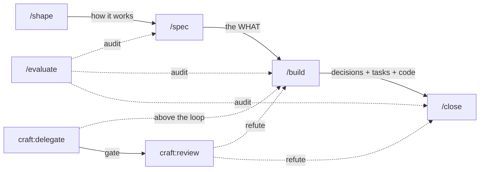

# Craft

A [Claude Code](https://docs.anthropic.com/en/docs/claude-code) plugin, a methodology for building features as **living visual documents**: one place per feature, in a format made for human understanding, kept current in real time.

## The idea

Most tooling makes you abstract away while the work happens, then hands you back an artifact (a markdown plan, a spec, a diff dump) that you have to reverse-engineer to understand. That **messy middle** breeds insecurity and kills the joy of the work.

Craft removes it. Everything a feature produces (how it works, how it looks, the WHAT (acceptance criteria), the HOW (decisions + tasks), the execution, the frictions) lives on **one board** per feature (`docs/craft/<feature>/data.json`, rendered as live-reloading HTML you watch fill in real time). Two pillars (`references/design-principles.md`):

- **A format built for understanding**: HTML with colors, shapes, arrows and live reload, on a shared design system so structure isn't reinvented each time, not raw markdown artifacts.
- **One feature, one place**: what used to scatter across `shape.md` / `spec.md` / `tech-plan.md` now lives together on the board.

## You're always in, or you're not, never the messy middle

**What the thing is, is always yours.** `/shape` and `/spec` have no mode: the shape of the feature and each acceptance criterion are decided with you, one at a time, never handed over. The board fills as you talk, so you always know what you are looking at, because you decided it.

**How it gets built has two modes** (`references/modes.md`):

- **`in the loop`** (default), you're in every task and every change, trivial ones included. Nothing is produced for one-shot approval.
- **`above the loop`**, you say go and validate the result: present at the start and the end, not the middle. Opt-in, explicit, never silent.

Either is fine. The messy middle, half-in, handed something you can't follow, is the one thing Craft refuses.

## The lifecycle


```mermaid
graph LR
    X["/shape"] -->|how it works| S["/spec"]
    S -->|the WHAT| B["/build"]
    B -->|decisions + tasks + code| C["/close"]
    E["/evaluate"] -.->|audit| S
    E -.->|audit| B
    E -.->|audit| C
    R["craft:review"] -.->|refute| B
    R -.->|refute| C
    D["craft:delegate"] -.->|above the loop| B
    D -->|gate| R
```

All four lifecycle skills write to the **same board** (`data.json`); the HTML is generated from it. Every task maps to an acceptance criterion (coverage is checked before code), and features ship in **phases**, each a vertical slice that puts something usable on screen, Phase 1 proving the core assumption.

## Quick start

```
/shape <feature>     → interview, prove, draw how it works, written onto the board
/spec <feature>      → define what to build (north star, acceptance criteria, phases)
/build <feature>     → decide the how + implement, task by task, in the loop
/close <feature>     → reconcile the board, graduate findings, propose commits
```

`/evaluate` audits at any point, and `/spec`, `/build` and `/close` run it at their own gates; `/board` opens the live board and `/board stop` closes it.

## File structure

```
CONTEXT.md                  # The project glossary: each term with its _Avoid_ line (/shape writes it, /close grows it, /spec reads it)
docs/craft/
├── decisions.md            # Cross-cutting decisions (only /close writes; created on demand)
└── <feature-slug>/
    ├── data.json           # The feature's single source of truth: exploration + WHAT + HOW + live status
    ├── how-it-works.svg    # The mechanism drawing, required to leave /shape
    └── look/               # Optional: screenshots or artboards of how it looks

~/code/craft/
├── lib/                    # board-serve.js (live board server) + doc/dashboard templates + schema.md
├── references/             # modes.md · design-principles.md · discipline.md · how-it-looks.md, inherited by all skills
├── skills/                 # shape · spec · build · close · evaluate · board
└── agents/                 # review · delegate
```

## Skills

| Skill | Purpose | Writes to |
|-------|---------|-----------|
| `/shape` | Interview to nothing blocking, prove assumptions, draw how it works | the board (`exploration`, `resolved`, `howItWorks`, `assumptions`) + `CONTEXT.md` |
| `/spec` | Define the WHAT + acceptance criteria | the board (`what`, `phases`) |
| `/build` | Decide the HOW + implement, in the loop | the board (`decisions`, `tasks`, status) + code |
| `/close` | Reconcile, graduate findings, propose commits | the board + `CLAUDE.md` / `decisions.md` / `CONTEXT.md` |
| `/evaluate` | Evidence-based audit of any output | verification findings |
| `/board` | Open the live board, or `stop` to close it | nothing |

| Agent | What it does | Who calls it |
|---|---|---|
| `craft:review` | Refutes a diff against the frozen ACs in a fresh context, on Opus | `/build` at a phase boundary, `/close` before the commits, `delegate` at its gates |
| `craft:delegate` | Executes a phase from the board without asking, gated by `review`, one report and a proposed commit | `/build` in `above the loop`, only when you hand it over |

Each skill's full documentation is in `skills/<name>/SKILL.md`. The data contract is `lib/schema.md`.

## Installation

### Plugin marketplace (recommended)

```bash
/plugin marketplace add juanwmedia/craft
/plugin install craft@craft
```

### From a clone, without installing

```bash
git clone https://github.com/juanwmedia/craft.git ~/code/craft
claude --plugin-dir ~/code/craft
```

Symlinking the skills into `~/.claude/skills/` does **not** work: they resolve `${CLAUDE_PLUGIN_ROOT}` to find the board server and the shared references, and a skill outside a plugin has no plugin root.

## License

MIT
