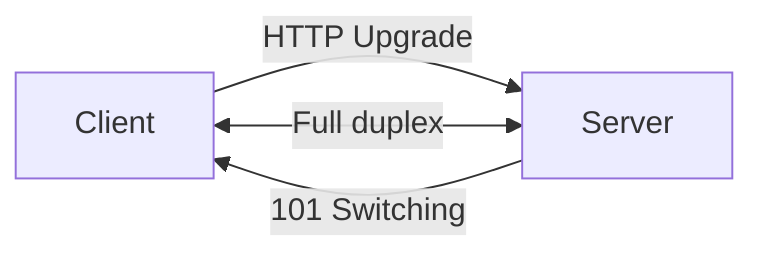

On-demand concept explanations. Auxiliary skill — works inside or outside CRAFT sessions.

Produces what a software engineer needs to work competently with the topic. Not an encyclopedia — just enough to make informed decisions.

## 1. Resolve topic

1. If the user passed an argument (e.g., `/understand WebSockets`), that's the topic.
2. If no argument, read the conversation context:
   - CRAFT session active (spec/tech-spec/plan/task visible) → explain the current artifact or the last completed task
   - No CRAFT context → ask: "What do you want to understand?"
3. The topic can be:
   - A concept: `WebSockets`, `inversion of control`, `database indexing`
   - A comparison: `SSE vs WebSockets`, `Eloquent vs Query Builder`
   - A project component: `DojoOrchestrationService`, `useDojoConversation composable`
   - A connection: `how does the turn log connect to question gating?`

## 2. Research

Before explaining, gather evidence:

- **Project component?** → Read the actual code. Use `Glob` and `Grep` to find the files, `Read` to understand them. Never explain a project component from memory.
- **Framework/library concept?** → Check the project for existing usage patterns first (`Grep` for imports, usage). Use `WebSearch`/`WebFetch` for official documentation if needed.
- **General CS concept?** → Use `WebSearch` if unsure about current best practices or if the concept has evolved.
- **Connection between things?** → Read both sides. Trace the data flow or dependency chain through the code.

## 3. Explain

Structure the explanation with these sections. Include only the ones that add value — skip any that would be filler.

### What it is
One paragraph. Plain language. No jargon without immediate definition. If comparing two things, explain each briefly first.

### How it works
The mechanism. For a pattern: the key idea and flow. For a framework feature: what it does under the hood. For a project component: what it receives, what it does, what it returns.

If a **Mermaid diagram** would clarify the flow or architecture, include one:

Use diagrams for: data flows, state machines, component relationships, request/response sequences. Do NOT use diagrams for simple concepts that are clearer in prose.

### In this project
If the concept exists in the current codebase, show the actual usage. Quote the real code with file path and line numbers. If it doesn't exist yet but is being planned (in a spec or tech-spec), reference the plan.

If the topic is a project component, this IS the main section — show the code, trace the flow, explain the decisions.

### When to use it (and when not to)
Practical guidance. When does this concept apply? What's the alternative? What are the trade-offs? One or two sentences for each.

### Prerequisites
If understanding this requires knowing something else first: "To fully understand X, you should know Y and Z." Link to other `/understand` topics if they exist in `docs/understand/`.

## 4. Persist (optional)

If the explanation includes a Mermaid diagram or is substantial enough to reference later:

1. Create `docs/understand/<topic-slug>.md` with the full explanation
2. Tell the user: "Saved to `docs/understand/<topic-slug>.md` — open it to see the diagram rendered."

Do NOT create a file for simple Q&A or brief explanations. The conversation itself is enough.

## 5. Iterate

After the initial explanation, stay open for follow-ups:
- "Explain the handshake part more" → expand that section, update the file if it exists
- "Compare with SSE" → add a comparison section
- "Show me an example" → find or write a code example
- "I don't get the diagram" → simplify or redraw

The explanation is a conversation, not a deliverable. Iterate until the user understands.

## Guardrails

- **Right-sized, not exhaustive.** Target: what a competent software engineer needs to know. If the explanation exceeds ~2 pages of markdown, you're over-explaining. Cut.
- **Teach, don't lecture.** Use the user's project as the example when possible. Abstract concepts are easier to understand with concrete code the user already works with.
- **Verify before explaining.** Do not explain from memory alone. Read the code, check the docs. If you're unsure, say so and look it up.
- **No invented diagrams.** Mermaid diagrams must accurately represent the actual flow or architecture. If you're not sure about the connections, read the code first.
- **Respect the user's level.** Read CLAUDE.md and conversation context for clues about expertise. Don't explain what they already know. Don't skip what they don't.
